# slskdAndroid

A native Android client for [slskd](https://github.com/slskd/slskd), the headless
Soulseek (peer-to-peer file sharing) daemon. slskd runs the actual Soulseek connection and
exposes a REST API plus a SignalR (WebSocket) interface; this app is the mobile front-end
that talks to your running slskd instance over the network.

## Features

- Search the Soulseek network with live, incrementally-updating results
- Browse other users' shared files
- Download and upload management
- Rooms and direct messages / chat
- Users tab with per-peer info

## Screenshots

Captured from the real app against a live slskd instance. Regenerated by the
[`Screenshots`](.github/workflows/screenshots.yml) workflow — the gallery below is written by
`tools/update_readme_screenshots.py`, so edit those rather than the table.

<!-- screenshots:start -->

<table>
  <tr><td align="center" width="33%">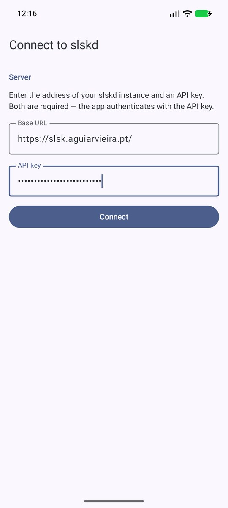 Connect</td><td align="center" width="33%">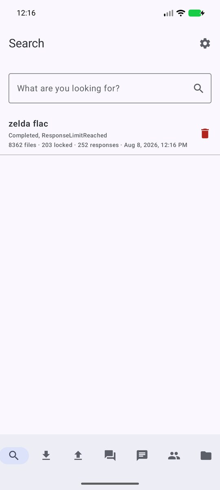 Searches</td><td align="center" width="33%">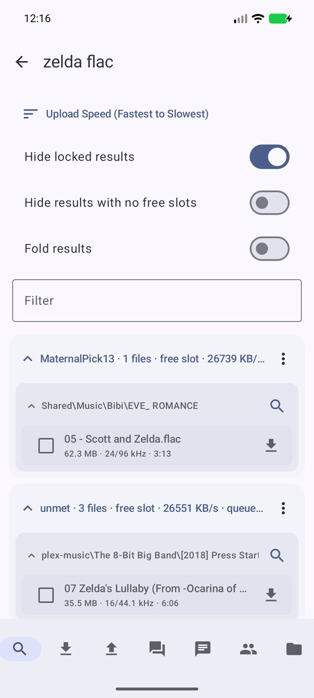 Search results</td></tr>
  <tr><td align="center" width="33%">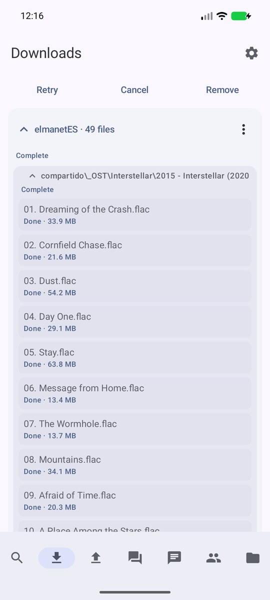 Downloads</td><td align="center" width="33%">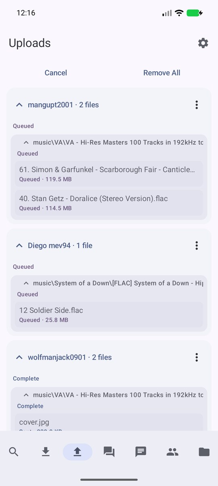 Uploads</td><td align="center" width="33%">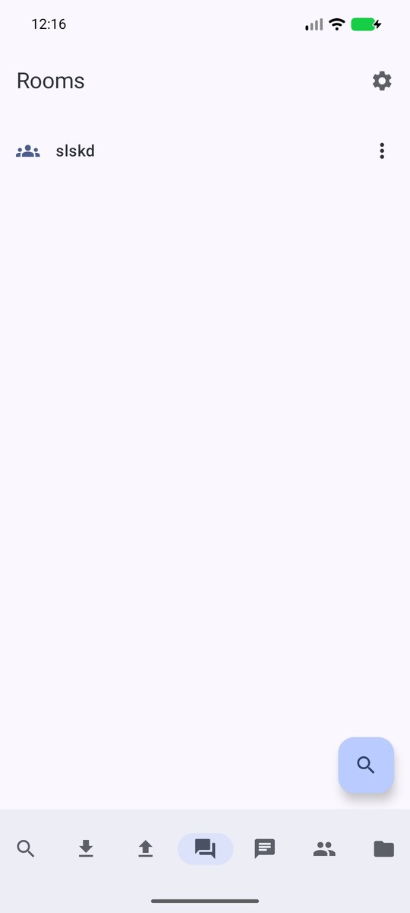 Rooms</td></tr>
  <tr><td align="center" width="33%">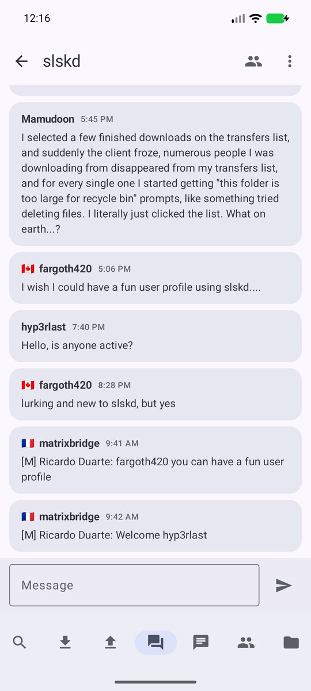 Room chat</td><td align="center" width="33%">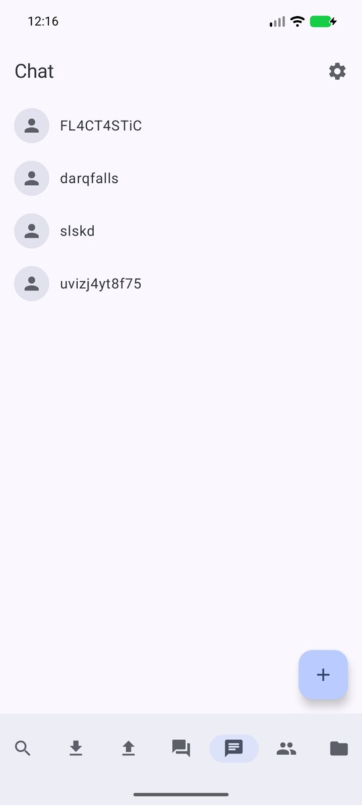 Chat</td><td align="center" width="33%">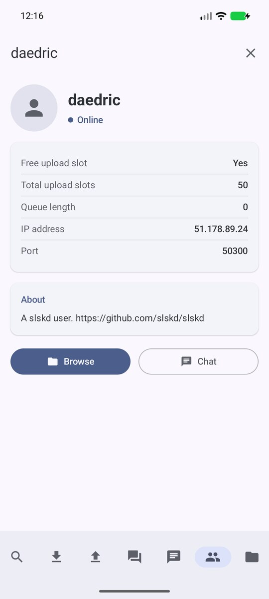 User profile</td></tr>
  <tr><td align="center" width="33%">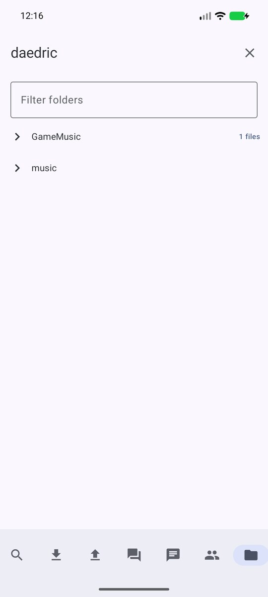 Browse</td><td align="center" width="33%">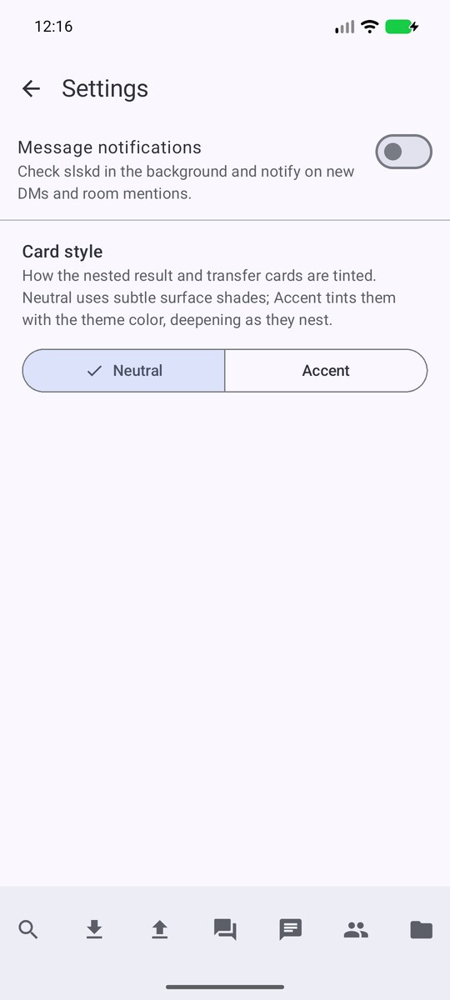 Settings</td></tr>
</table>

<!-- screenshots:end -->

## Requirements

- Android 8.0 (API 26) or newer.
- A running, reachable [slskd](https://github.com/slskd/slskd) instance.
- An slskd **API key** (configured on your slskd server). The app authenticates with this
  key via the `X-API-Key` header; there is no username/password login.

## Setup

On first launch the app guides you through a one-time connection setup:

1. Enter the URL of your slskd instance (for example `https://slskd.example.com` or
   `http://192.168.1.10:5030`).
2. Enter your slskd API key.

The settings are validated against your server before they are saved. Once connected, the
app remembers them and goes straight to the main screen on subsequent launches.

## Installation

- Download an APK from the [Releases](../../releases) page, or
- Build from source (see `RELEASE.md` for build, signing, and CI details).

## Tech

Kotlin, Jetpack Compose with Material 3 Expressive, MVVM, Hilt, and a multi-module
(feature-based) architecture. See `CLAUDE.md` for the full toolchain and architecture notes.
